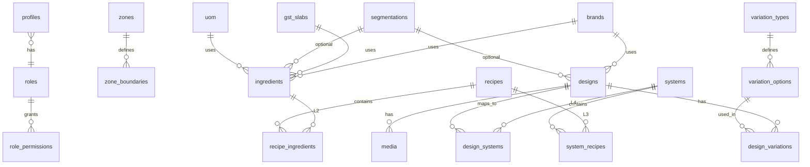

# EKATAN — Supabase PostgreSQL Database Schema

This document defines the complete relational database schema for EKATAN: the 4-Level Cost Engine (L1–L4), dynamic master data (brands, UOM, segmentations, GST, media, variations), Users/RBAC, and 5km Zone Mapping (PostGIS).

**Target:** Supabase (PostgreSQL). Enable PostGIS via Dashboard → Database → Extensions → `postgis` (create `gis` schema if prompted).

---

## Schema Overview

---

## 1. Users & RBAC

### 1.1 `roles`

| Column       | Type         | Constraints |
|-------------|--------------|-------------|
| id          | uuid         | PRIMARY KEY, DEFAULT gen_random_uuid() |
| name        | text         | NOT NULL, UNIQUE (e.g. admin, designer, supervisor, customer, analyst) |
| description | text         | |

### 1.2 `permissions`

| Column   | Type | Constraints |
|----------|------|-------------|
| id       | uuid | PRIMARY KEY, DEFAULT gen_random_uuid() |
| name     | text | NOT NULL |
| resource | text | NOT NULL (e.g. catalog, quote, project) |
| action   | text | NOT NULL (e.g. read, write) |

### 1.3 `role_permissions`

| Column       | Type | Constraints |
|-------------|------|-------------|
| role_id     | uuid | NOT NULL, REFERENCES roles(id) ON DELETE CASCADE |
| permission_id | uuid | NOT NULL, REFERENCES permissions(id) ON DELETE CASCADE |
| PRIMARY KEY | (role_id, permission_id) |

### 1.4 `profiles`

Extends `auth.users`. Create trigger to insert row on signup.

| Column   | Type | Constraints |
|----------|------|-------------|
| id       | uuid | PRIMARY KEY, REFERENCES auth.users(id) ON DELETE CASCADE |
| role_id  | uuid | NOT NULL, REFERENCES roles(id) |
| zone_id  | uuid | REFERENCES zones(id) (nullable; used for supervisors) |
| full_name | text | |
| created_at | timestamptz | DEFAULT now() |
| updated_at | timestamptz | DEFAULT now() |

### 1.5 `user_roles`

Optional many-to-many if a user can have multiple roles.

| Column   | Type | Constraints |
|----------|------|-------------|
| user_id  | uuid | NOT NULL, REFERENCES auth.users(id) ON DELETE CASCADE |
| role_id  | uuid | NOT NULL, REFERENCES roles(id) ON DELETE CASCADE |
| PRIMARY KEY | (user_id, role_id) |

---

## 2. Zone Mapping (PostGIS)

Requires PostGIS extension. Use `gis` schema for geography types if created by Supabase.

### 2.1 `zones`

| Column       | Type    | Constraints |
|-------------|---------|-------------|
| id          | uuid    | PRIMARY KEY, DEFAULT gen_random_uuid() |
| name        | text    | NOT NULL |
| description | text    | |
| is_active   | boolean | DEFAULT true |

### 2.2 `zone_boundaries`

| Column     | Type | Constraints |
|------------|------|-------------|
| id         | uuid | PRIMARY KEY, DEFAULT gen_random_uuid() |
| zone_id    | uuid | NOT NULL, REFERENCES zones(id) ON DELETE CASCADE |
| boundary   | geography(POLYGON) | (PostGIS; use gis schema if applicable) |
| radius_km  | numeric(6,2) | For circular 5km zones; optional |

**Index:** `CREATE INDEX zone_boundaries_geo_idx ON zone_boundaries USING GIST (boundary);` for `ST_Contains`, `ST_DWithin` queries.

---

## 3. Dynamic Master Data (Brands, Segmentations, GST)

All cost-engine entities reference these tables; no hardcoded brands, tax rates, or segments.

### 3.1 `brands`

| Column       | Type    | Constraints |
|-------------|---------|-------------|
| id          | uuid    | PRIMARY KEY, DEFAULT gen_random_uuid() |
| name        | text    | NOT NULL |
| logo_url    | text    | |
| description | text    | |
| is_active   | boolean | DEFAULT true |
| created_at  | timestamptz | DEFAULT now() |
| updated_at  | timestamptz | DEFAULT now() |

### 3.2 `segmentations`

Product/customer pricing tiers (e.g. premium, economy, standard).

| Column       | Type | Constraints |
|-------------|------|-------------|
| id          | uuid | PRIMARY KEY, DEFAULT gen_random_uuid() |
| name        | text | NOT NULL |
| code        | text | NOT NULL, UNIQUE |
| description | text | |
| created_at  | timestamptz | DEFAULT now() |

### 3.3 `gst_slabs`

Time-bound tax rates. Cost engine resolves current slab by `effective_from` / `effective_to`.

| Column         | Type | Constraints |
|----------------|------|-------------|
| id             | uuid | PRIMARY KEY, DEFAULT gen_random_uuid() |
| rate           | numeric(5,2) | NOT NULL (e.g. 18.00) |
| hsn_code       | text | |
| description    | text | |
| effective_from | date | NOT NULL |
| effective_to   | date | (nullable; NULL = no end date) |
| created_at     | timestamptz | DEFAULT now() |

---

## 4. UOM (Units of Measure) — Dynamic

All cost-bearing entities reference `uom_id`; no hardcoded units.

### 4.1 `uom`

| Column       | Type | Constraints |
|-------------|------|-------------|
| id          | uuid | PRIMARY KEY, DEFAULT gen_random_uuid() |
| code        | text | NOT NULL, UNIQUE (sqft, rft, kg, pcs, sheet, ltr, bag, box, sqft_carpentry, sqft_civil) |
| name        | text | NOT NULL |
| base_uom_id | uuid | REFERENCES uom(id) (nullable; for conversions) |

### 4.2 `uom_conversions`

| Column       | Type | Constraints |
|-------------|------|-------------|
| from_uom_id | uuid | NOT NULL, REFERENCES uom(id) |
| to_uom_id   | uuid | NOT NULL, REFERENCES uom(id) |
| multiplier  | numeric(12,6) | NOT NULL (e.g. 1 sheet = 32 sqft → from sheet to sqft, multiplier 32) |
| PRIMARY KEY | (from_uom_id, to_uom_id) |

---

## 5. L1 — Ingredients (Raw Materials & Labor) — Dynamic

### 5.1 `ingredient_categories`

| Column | Type | Constraints |
|--------|------|-------------|
| id     | uuid | PRIMARY KEY, DEFAULT gen_random_uuid() |
| name   | text | NOT NULL (Raw Material, Labor, Hardware, etc.) |

### 5.2 `ingredients`

| Column              | Type | Constraints |
|---------------------|------|-------------|
| id                  | uuid | PRIMARY KEY, DEFAULT gen_random_uuid() |
| name                | text | NOT NULL |
| uom_id              | uuid | NOT NULL, REFERENCES uom(id) |
| category_id         | uuid | NOT NULL, REFERENCES ingredient_categories(id) |
| brand_id            | uuid | REFERENCES brands(id) |
| rate_per_unit       | numeric(14,4) | NOT NULL |
| wastage_coefficient | numeric(6,4) | NOT NULL, DEFAULT 1 (e.g. 1.15 = 15% wastage) |
| gst_slab_id         | uuid | NOT NULL, REFERENCES gst_slabs(id) |
| segmentation_id     | uuid | REFERENCES segmentations(id) |
| is_active           | boolean | DEFAULT true |
| created_at          | timestamptz | DEFAULT now() |
| updated_at          | timestamptz | DEFAULT now() |

**Cost logic:** Apply `wastage_coefficient` at costing; resolve GST from `gst_slabs` by effective date.

---

## 6. L2 — Recipes (2D Sub-Assemblies)

### 6.1 `recipes`

| Column                 | Type | Constraints |
|------------------------|------|-------------|
| id                     | uuid | PRIMARY KEY, DEFAULT gen_random_uuid() |
| name                   | text | NOT NULL |
| description            | text | |
| output_uom_id          | uuid | NOT NULL, REFERENCES uom(id) |
| output_quantity_per_unit | numeric(12,6) | NOT NULL (e.g. 1 recipe = 1 sqft shutter) |
| created_at             | timestamptz | DEFAULT now() |
| updated_at             | timestamptz | DEFAULT now() |

### 6.2 `recipe_ingredients`

| Column             | Type | Constraints |
|--------------------|------|-------------|
| id                 | uuid | PRIMARY KEY, DEFAULT gen_random_uuid() |
| recipe_id          | uuid | NOT NULL, REFERENCES recipes(id) ON DELETE CASCADE |
| ingredient_id      | uuid | NOT NULL, REFERENCES ingredients(id) |
| quantity_per_output | numeric(12,6) | NOT NULL |
| wastage_override   | numeric(6,4) | (nullable; if null, use ingredient default) |

**Cost logic:** Cost of 1 unit output = sum over rows of (quantity_per_output × ingredient.rate_per_unit × (wastage_override OR ingredient.wastage_coefficient)).

---

## 7. L3 — Systems (3D Functional Units)

### 7.1 `systems`

| Column          | Type | Constraints |
|-----------------|------|-------------|
| id              | uuid | PRIMARY KEY, DEFAULT gen_random_uuid() |
| name            | text | NOT NULL |
| description     | text | |
| brand_id        | uuid | REFERENCES brands(id) |
| segmentation_id | uuid | REFERENCES segmentations(id) |
| base_width_mm   | numeric(10,2) | |
| base_depth_mm   | numeric(10,2) | |
| base_height_mm  | numeric(10,2) | |
| created_at      | timestamptz | DEFAULT now() |
| updated_at      | timestamptz | DEFAULT now() |

### 7.2 `system_recipes`

| Column     | Type | Constraints |
|------------|------|-------------|
| id         | uuid | PRIMARY KEY, DEFAULT gen_random_uuid() |
| system_id  | uuid | NOT NULL, REFERENCES systems(id) ON DELETE CASCADE |
| recipe_id  | uuid | NOT NULL, REFERENCES recipes(id) |
| quantity   | numeric(12,6) | NOT NULL (e.g. 2 for door, 1 for side) |
| applies_to | text | (e.g. 'door', 'side', 'base') |

### 7.3 `system_hardware`

| Column            | Type | Constraints |
|-------------------|------|-------------|
| id                | uuid | PRIMARY KEY, DEFAULT gen_random_uuid() |
| system_id         | uuid | NOT NULL, REFERENCES systems(id) ON DELETE CASCADE |
| ingredient_id     | uuid | NOT NULL, REFERENCES ingredients(id) |
| quantity_per_unit | numeric(12,6) | NOT NULL (e.g. hinges, handles per cabinet) |

---

## 8. L4 — Designs (Customer-Facing Products) — Dynamic

### 8.1 `designs`

| Column           | Type | Constraints |
|------------------|------|-------------|
| id               | uuid | PRIMARY KEY, DEFAULT gen_random_uuid() |
| name             | text | NOT NULL |
| slug             | text | NOT NULL, UNIQUE |
| description      | text | |
| brand_id         | uuid | REFERENCES brands(id) |
| segmentation_id  | uuid | REFERENCES segmentations(id) |
| is_active        | boolean | DEFAULT true |
| created_at       | timestamptz | DEFAULT now() |
| updated_at       | timestamptz | DEFAULT now() |

### 8.2 `design_systems`

| Column           | Type | Constraints |
|------------------|------|-------------|
| id               | uuid | PRIMARY KEY, DEFAULT gen_random_uuid() |
| design_id        | uuid | NOT NULL, REFERENCES designs(id) ON DELETE CASCADE |
| system_id        | uuid | NOT NULL, REFERENCES systems(id) |
| dimension_formula | jsonb | (W×D×H from customer input; e.g. {"w": "width_mm", "d": "depth_mm", "h": "height_mm"}) |

### 8.3 `design_params`

| Column         | Type | Constraints |
|----------------|------|-------------|
| id             | uuid | PRIMARY KEY, DEFAULT gen_random_uuid() |
| design_id      | uuid | NOT NULL, REFERENCES designs(id) ON DELETE CASCADE |
| param_name     | text | NOT NULL |
| param_type     | text | NOT NULL (e.g. length, width, height) |
| default_value  | numeric(12,4) | |
| min            | numeric(12,4) | |
| max            | numeric(12,4) | |

**Example:** "Fluted TV Panel" design → maps to System "Wall Panel" with parametric W, H; cost = system cost × (W/600) × (H/2400).

---

## 9. Media (Images) — Multi-Entity, Dynamic

### 9.1 `media`

| Column       | Type | Constraints |
|-------------|------|-------------|
| id          | uuid | PRIMARY KEY, DEFAULT gen_random_uuid() |
| entity_type | text | NOT NULL (design, ingredient, system, brand) |
| entity_id   | uuid | NOT NULL |
| url         | text | NOT NULL (Supabase Storage path; public or signed) |
| alt_text    | text | |
| sort_order  | int  | DEFAULT 0 |
| created_at  | timestamptz | DEFAULT now() |

**Storage:** Use Supabase Storage buckets with RLS; `url` stores the public or signed path.

---

## 10. Variations — Dynamic (Colour, Finish, Size)

### 10.1 `variation_types`

| Column | Type | Constraints |
|--------|------|-------------|
| id     | uuid | PRIMARY KEY, DEFAULT gen_random_uuid() |
| name   | text | NOT NULL (Colour, Finish, Size) |
| code   | text | NOT NULL, UNIQUE |

### 10.2 `variation_options`

| Column           | Type | Constraints |
|------------------|------|-------------|
| id               | uuid | PRIMARY KEY, DEFAULT gen_random_uuid() |
| variation_type_id | uuid | NOT NULL, REFERENCES variation_types(id) ON DELETE CASCADE |
| name             | text | NOT NULL (e.g. White, Walnut; Matte, Gloss) |
| code             | text | NOT NULL |

### 10.3 `design_variations`

| Column             | Type | Constraints |
|--------------------|------|-------------|
| id                 | uuid | PRIMARY KEY, DEFAULT gen_random_uuid() |
| design_id          | uuid | NOT NULL, REFERENCES designs(id) ON DELETE CASCADE |
| variation_option_id | uuid | NOT NULL, REFERENCES variation_options(id) ON DELETE CASCADE |
| cost_delta         | numeric(14,4) | NOT NULL (can be 0) |
| is_default         | boolean | DEFAULT false |

**Cost logic:** Customer selects variation options; cost = base design cost + sum of `cost_delta` for selected options.

---

## 11. Supporting Tables

### 11.1 `projects`

| Column       | Type | Constraints |
|-------------|------|-------------|
| id          | uuid | PRIMARY KEY, DEFAULT gen_random_uuid() |
| customer_id | uuid | NOT NULL, REFERENCES auth.users(id) |
| zone_id     | uuid | REFERENCES zones(id) |
| status      | text | NOT NULL |
| created_at  | timestamptz | DEFAULT now() |
| updated_at  | timestamptz | DEFAULT now() |

### 11.2 `quotes`

| Column       | Type | Constraints |
|-------------|------|-------------|
| id          | uuid | PRIMARY KEY, DEFAULT gen_random_uuid() |
| project_id  | uuid | NOT NULL, REFERENCES projects(id) ON DELETE CASCADE |
| designer_id | uuid | REFERENCES auth.users(id) |
| total_cost  | numeric(14,4) | |
| status      | text | NOT NULL |
| created_at  | timestamptz | DEFAULT now() |
| updated_at  | timestamptz | DEFAULT now() |

### 11.3 `quote_items`

| Column               | Type | Constraints |
|----------------------|------|-------------|
| id                   | uuid | PRIMARY KEY, DEFAULT gen_random_uuid() |
| quote_id             | uuid | NOT NULL, REFERENCES quotes(id) ON DELETE CASCADE |
| design_id             | uuid | NOT NULL, REFERENCES designs(id) |
| params                | jsonb | (dimensions W×D×H) |
| variation_option_ids  | jsonb | (array of variation_option ids) |
| quantity              | numeric(12,4) | NOT NULL |
| unit_cost             | numeric(14,4) | |
| total_cost            | numeric(14,4) | |
| created_at            | timestamptz | DEFAULT now() |

### 11.4 `snags`

| Column       | Type | Constraints |
|-------------|------|-------------|
| id          | uuid | PRIMARY KEY, DEFAULT gen_random_uuid() |
| project_id  | uuid | NOT NULL, REFERENCES projects(id) ON DELETE CASCADE |
| description | text | NOT NULL |
| status      | text | NOT NULL |
| location    | text | |
| reported_by | uuid | REFERENCES auth.users(id) |
| created_at  | timestamptz | DEFAULT now() |
| updated_at  | timestamptz | DEFAULT now() |

---

## 12. Row Level Security (RLS)

- Enable RLS on all tables in the `public` schema (and on `storage.objects` for Supabase Storage).
- Policies should be keyed off `auth.uid()` and, where applicable, `auth.jwt() ->> 'role'` (injected via Supabase Auth Hook).
- **admin:** full access to all tables.
- **designer:** read catalog (ingredients, recipes, systems, designs, brands, uom, etc.); write quotes and quote_items.
- **supervisor:** read projects and snags in assigned zone (via `profiles.zone_id`).
- **customer:** read/write own projects and quotes (where `project.customer_id = auth.uid()`).
- **analyst:** read-only access to analytics-related tables (no write).

Implement Auth Hook to attach role (from `profiles.role_id` or `user_roles`) to JWT custom claims after login.

---

## 13. Security Parameters (Application & DB)

**Authentication & session:** Supabase Auth (JWT + refresh tokens); use secure, httpOnly cookies when using SSR. Enforce strong password policy; optional MFA for admin/designer.

**Authorization:** RLS on all public tables; Server Actions must call `auth.getUser()` before every DB operation and enforce role checks for admin/designer/supervisor actions.

**Input validation:** Validate all inputs in Server Actions (e.g. Zod); reject malformed or oversized payloads.

**Secrets:** `SUPABASE_SERVICE_ROLE_KEY` must be server-only; never expose to client. Use `NEXT_PUBLIC_*` only for non-sensitive values (e.g. URL, anon key).

**Supabase Storage:** RLS on `storage.objects`; bucket policies so only authenticated roles (e.g. admin, designer) can upload; restrict read by entity/ownership where needed.

**Audit:** Consider audit logging for sensitive mutations (quotes, projects, catalog changes) for compliance and debugging.
